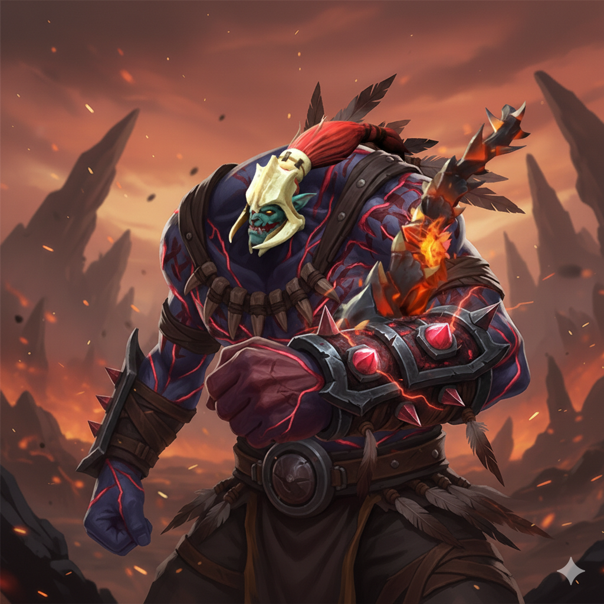

# Dota 2 Hero Ranker

Это приложение позволяет вам ранжировать персонажей Dota 2 по системе турнира (плей-офф). Вы выбираете одного из двух героев, пока не останется единственный победитель.

## 🚀 Как запустить
Просто откройте `index.html` в вашем браузере.

## 🖼️ Как заменить изображения
Пользователь упомянул, что возьмет картинки сам. Чтобы добавить свои фото:
1. Поместите изображения в папку `assets/heroes/` (создайте её, если нужно).
2. Откройте `src/app.js`.
3. Отредактируйте массив `HEROES`, заменив ссылки `img` на пути к вашим файлам (например, `"assets/heroes/pudge.jpg"`).

## ✨ Особенности
- **Премиальный дизайн**: Темная тема в стиле Dota 2 с эффектами стекломорфизма.
- **Интуитивная логика**: Проигравшие герои выбывают и больше не появляются.
- **Финальный экран**: Победитель отображается на весь экран в конце.

## Технологии
- HTML5 / CSS3 (Vanilla)
- JavaScript (ES6+)
- Google Fonts (Outfit)
